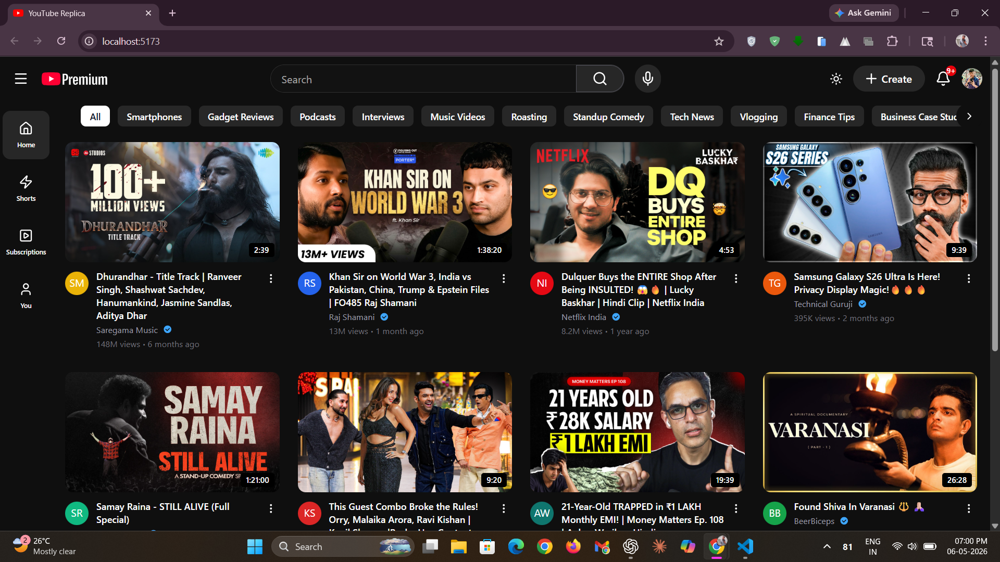
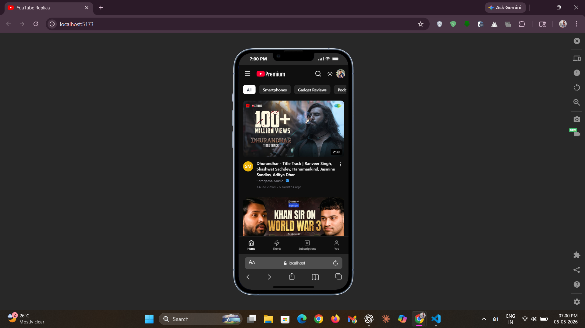

# YouTube Replica ▶️


**YouTube Replica** is a modern, highly responsive frontend clone of the YouTube user interface, built with performance and user experience in mind, this project demonstrates advanced component composition, state management, and modern styling techniques.

**🌐 Live Demo :** [see youtube replica!](https://youtubereplicaa.vercel.app/)

## 🎨 UI/UX Highlights

✨ Crafted to closely recreate the modern YouTube browsing experience with a clean, responsive and interactive interface.

- 📺 Modern YouTube-inspired UI with polished layouts  
- 🌗 Seamless Light / Dark theme switching  
- 📱 Responsive experience across mobile, tablet, and desktop  
- ⚡ Smooth scrolling and fluid user interactions  
- 🧭 Sticky navigation for better accessibility and usability  
- 🏷️ Interactive category pills with horizontal scrolling  
- 🎬 Video cards with hover animations and rich metadata  
- 🔍 Adaptive search bar optimized for different screen sizes  
- 📌 Mobile bottom navigation inspired by the YouTube app  
- 🎯 Clean spacing, accessibility, and user-focused design   

## ✨ Features

### 📺 Dynamic Video Feed
- Responsive video grid for mobile, tablet, and desktop screens  
- Reusable `VideoPill` components with thumbnails, avatars, titles, and metadata  
- Smooth hover effects and interactive UI elements  
- Clean YouTube-inspired video browsing experience  

### 🏷️ Interactive Category Navigation
- Scrollable category pills for content filtering  
- Smooth horizontal scrolling experience  
- Active category highlighting for better navigation  
- Responsive category layout optimized for all devices  

### 🌗 Adaptive Theming & Layout
- Full Light / Dark mode support  
- Responsive sidebar and mobile bottom navigation  
- Sticky header with responsive search functionality  
- Optimized layout and spacing for a native app-like experience  
- Mobile-friendly UI with smooth responsiveness  

## 🛠️ Tech Stack Used

- 🎨 Frontend: React.js, TypeScript, Tailwind CSS, HTML5, CSS3  
- ⚙️ UI Components & Icons: Lucide React  
- 🌗 Styling & Theming: Tailwind Dark Mode  
- 📱 Responsive Design: Mobile-First Layout  
- ⚡ Build Tool: Vite  
- 🧹 Code Quality: ESLint  
- 🔧 Version Control: Git & GitHub  
- 🚀 Deployment: Vercel  

## 📸 Screenshots

### 🖥️ User Interface

*Modern YouTube-inspired interface with clean layouts, dark/light theme toggle and interactive components.*

### 📱 Responsive Design

*Fully responsive design optimized for mobile, tablet and desktop screens.*

## 🛠️ Setup and Installation

Follow these steps to run the project locally on your machine:

### 1️⃣ Clone the Repository

```bash
git clone https://github.com/deepanshu1420/YouTube-Replica.git
cd YouTube-Replica
```

### 2️⃣ Install Dependencies

Make sure you have **Node.js** installed, then run:

```bash
npm install
```

### 3️⃣ Start Development Server

```bash
npm run dev
```

### 4️⃣ Open the Application

Open your browser and visit:

```bash
http://localhost:5173
```

The app should now be running locally 🚀